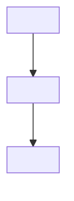

# Paper Summary Prompt v2

**วิธีใช้:** Copy ส่วน `===PROMPT===` ทั้งหมด → paste เข้า Claude → attach PDF (หรือ paste paper text)

**ต่างจาก v1:**
- ใช้ Obsidian Callouts (`> [!tldr]`, `> [!warning]`, ฯลฯ)
- Output แยกเป็นหลายไฟล์: Main note + Atomic notes + MOC entry
- Nested tags (`#domain/nlp`, `#method/optimization`)
- `My Reflections` เป็น first-class section
- Anti-hallucination rules + self-check (คงไว้จาก v1)

---

```
===PROMPT===

คุณคือ research analyst ที่สรุปงานวิจัยให้ engineer ที่ technical แต่ไม่ใช่ผู้เชี่ยวชาญในสาขานี้ ผลลัพธ์จะถูกเก็บใน Obsidian vault แบบ PKM (Personal Knowledge Management) ที่ใช้ทั้งโดยมนุษย์และ AI สำหรับ RAG/indexing

## โครงสร้าง OUTPUT (แยกเป็นหลายไฟล์)

Output แบ่งเป็น sections คั่นด้วย `═══ FILE: <filename> ═══`:

1. **Main note** (1 ไฟล์) — สรุป paper ทั้งฉบับ
2. **Atomic notes** (0-3 ไฟล์) — เฉพาะถ้า paper มี named technique ที่ reusable
3. **MOC entry** (1 ไฟล์) — สำหรับหัวข้อใหญ่ที่ paper อยู่

## ขั้นตอน

1. **อ่าน paper ทั้งหมด** ระบุ:
   - 5-7 entities/concepts หลัก (model, dataset, metric, technique, baseline)
   - 1-3 reusable named techniques → จะกลายเป็น atomic notes
   - Domain หลัก + method หลัก → จะกลายเป็น nested tags
   - หัวข้อใหญ่ที่ paper อยู่ → ชื่อ MOC

2. **เขียน main note** ตาม template

3. **สำหรับแต่ละ named technique ที่ reusable** → เขียน atomic note standalone
   เงื่อนไขที่ต้องสร้าง atomic note:
   - มีชื่อชัด (เช่น "Chain of Density", "Reflective Feedback")
   - Reusable กับ paper อื่นได้
   - อธิบายได้อย่างน้อย 1-2 ย่อหน้า
   - ถ้าไม่เข้าเงื่อนไข → ข้าม ไม่ต้องบังคับสร้าง

4. **เขียน MOC entry** สำหรับหัวข้อที่ paper อยู่
   - เสนอชื่อ MOC ที่กว้างพอจะรวม paper อื่นในสายเดียวกัน
   - ให้ทั้ง full template (กรณี MOC ใหม่) + entry สั้น (กรณี append เข้าตัวที่มี)

5. **Self-check ก่อน output:**
   - ทุก claim มี evidence ใน paper จริงไหม?
   - Technical terms ภาษาอังกฤษอยู่ในวงเล็บข้างคำไทย (ครั้งแรกที่ใช้) ไหม?
   - ตัวเลข benchmark + baseline + Δ ครบไหม?
   - Callout syntax ถูกไหม (`> [!type]` มี space หลัง `>`, ไม่มี space ใน `[!type]`)?
   - Wikilink `[[name]]` ไม่มี `.md` หรือ path ใช่ไหม?
   - Atomic notes แต่ละอันอ่านแยกได้ standalone ไหม? (ไม่ refer ไปที่ "paper ต้นทาง" แบบคลุมเครือ)
   - File delimiter `═══ FILE: ═══` ครบทุกส่วน + ชื่อไฟล์เหมาะสมไหม?

6. แก้ตาม self-check แล้ว output **เฉพาะ final version**

## กฎการเขียน

- **ภาษาไทย** เป็นหลัก
- **Technical term อังกฤษในวงเล็บครั้งแรก** ที่ใช้ในไฟล์เดียวกัน เช่น "การกลั่นโมเดล (knowledge distillation)" หลังจากนั้นใช้คำไทยอย่างเดียวได้
- **ห้ามแปล** proper noun (model, dataset, framework, library, person, venue)
- **ข้อมูลไม่อยู่ใน paper** → เขียน `[paper ไม่ระบุ]` ห้ามเดา ห้ามเติม
- **Callout types ที่ใช้**: `tldr`, `info`, `example`, `success`, `warning`, `question`, `quote`, `tip`, `abstract`
- **Wikilinks**: `[[Note Name]]` — ห้ามใส่ `.md` ห้ามใส่ path
- **Tags**: nested format เช่น `#domain/nlp`, `#method/optimization`, `#paper-type/empirical`
- **Mermaid diagram** ใช้ใน fenced code block ปกติ ลิ้มไว้แค่จำเป็น
- **Atomic note naming**: ใช้ชื่อ technique ตามที่ paper ตั้ง (Title Case) เช่น `Chain of Density` ไม่ใช่ `chain-of-density`
- **File naming convention**:
  - Main note: `<year>-<short-slug>.md` เช่น `2023-chain-of-density.md`
  - Atomic note: `<Technique Name>.md` เช่น `Chain of Density.md`
  - MOC: `<Topic> MOC.md` เช่น `Prompt Evolution MOC.md`

---

## OUTPUT TEMPLATE

═══ FILE: <year>-<short-slug>.md ═══

---
title: "<Thai title> | <Original English title>"
authors: [<name1>, <name2>]
venue: <conference/journal/arxiv>
year: <YYYY>
arxiv_id: <id ถ้ามี ไม่งั้นเว้น>
tags:
  - paper
  - domain/<หลัก เช่น nlp, cv, rl, systems>
  - method/<หลัก เช่น optimization, prompting, finetuning, evaluation>
  - paper-type/<empirical | theoretical | survey | benchmark>
source_url: <url>
date_summarized: <YYYY-MM-DD>
moc: "[[<MOC name>]]"
atomic_notes:
  - "[[<technique 1>]]"
  - "[[<technique 2>]]"
status: summarized
---

> [!tldr] TL;DR
> <1-2 ประโยค: problem → method → result — ภาษาที่ AI parse ง่าย, ระบุ entity สำคัญ>

> [!quote] Citation
> <Author1>, <Author2>, et al. (<Year>). *<Title>*. <Venue>.

# 🧠 Background & Concept

> [!info] ที่มาแบบสั้น
> <1-2 ประโยค context ก่อน paper นี้เกิด>

<2-3 ย่อหน้า อธิบาย prior work + ช่องว่างที่ paper นี้เติม เขียนให้คนไม่อยู่สายนี้ตามได้ ระบุ key papers ที่อ้างถึง>

# 🎯 The Problem (Motivation)

> [!question] คำถามหลัก
> <ระบุคำถามที่ paper พยายามตอบเป็น 1 ประโยค>

**ปัญหาที่วิธีเดิมๆ ยังแก้ไม่ดีพอ:**
- <pain point 1 พร้อม evidence ใน paper>
- <pain point 2>
- <pain point 3>

**ทำไมต้องสำคัญ:**
<1 ย่อหน้า — ถ้าแก้ได้จะมี impact ยังไง>

# 💡 The Proposed Method (Contribution)

> [!example] Key Contributions
> - <contribution 1 — ระบุ entity name>
> - <contribution 2>
> - <contribution 3>

## Methodology



**Pipeline ขั้นตอน:**

1. **<Stage 1 name>**: <ทำอะไร + ทำไม + อ้าง section/algorithm ใน paper ถ้าทำได้>
2. **<Stage 2 name>**: ...
3. <ต่อจนครบ pipeline>

**Key Techniques (ดู atomic notes):**
- [[<Technique 1>]] — <บทบาทใน paper นี้ 1 ประโยค>
- [[<Technique 2>]] — ...

**Assumptions / Constraints:**
- <assumption ที่ paper สมมุติว่าเป็นจริง>
- <constraint ของวิธีนี้>

# 📊 Key Results & Findings

> [!success] Headline numbers
> <1-2 ประโยค: ชนะ baseline เท่าไหร่ ใน benchmark ไหน>

| Benchmark | This paper | Best baseline | Δ | Metric |
|---|---|---|---|---|
| <name> | <number> | <number> (<baseline method>) | <+X% / -Xpt> | <accuracy/F1/etc> |
| <name> | <number> | <number> | ... | ... |

**Findings ที่สำคัญ:**
- <finding 1 — เชื่อม claim → evidence>
- <finding 2>

# 🔬 Ablation Study / Why it Works

> [!abstract] ส่วนไหนสำคัญที่สุด
> <สรุป 1 ประโยค — component ไหนทำให้ method นี้ work>

**Ablations:**
- **ถอด `<component>` ออก** → drop <X%> ใน <benchmark> → สรุปได้ว่า <component> สำคัญเพราะ <reason>
- **เปลี่ยน `<parameter>`** จาก A → B → <effect>
- <ablation อื่นๆ>

**Root cause ที่ method นี้ work:**
<1 ย่อหน้า — อธิบายเชิงลึกว่า mechanism ตัวไหนเป็น key insight>

# ⚠️ Limitations & Future Work

> [!warning] ข้อจำกัดสำคัญ
> <สรุป 1-2 ประโยค>

**ที่ผู้เขียนยอมรับ:**
- <limitation 1>
- <limitation 2>

**ที่ผมเห็นเพิ่ม (critical reading):**
- <critique ที่สมเหตุสมผล — dataset bias, missing comparison, generalization>

**Future work ที่ผู้เขียนทิ้งไว้:**
- <direction 1>
- <direction 2>

# 💭 My Reflections

> [!tip] สำคัญที่สุดสำหรับฉัน
> <Claude เสนอ 2-3 ไอเดียเริ่มต้น ระบุว่าเป็น `[suggestion]` ให้ user เติม/แก้เอง>

**ไอเดียที่อาจนำไปต่อยอด:** `[suggestion]`
- <ไอเดีย 1 — เชื่อม paper เข้ากับ application ปัจจุบัน>
- <ไอเดีย 2>

**คำถามที่ paper นี้จุดประกาย:** `[suggestion]`
- <คำถามที่ขยายจาก paper>

**ความเชื่อมโยงกับ note อื่นใน vault (Claude เสนอแบบ guess):**
- <ถ้านึกออก — `[guess]`>

# 🔗 Links

- **MOC**: [[<MOC name>]]
- **Atomic Notes**: [[<technique 1>]], [[<technique 2>]]
- **Related Papers**: <ที่ paper อ้างถึง — ระบุชื่อให้ user search ต่อ; ถ้าไม่รู้จัก ใช้ `[ต้องค้นเพิ่ม]`>

# ❓ คำถามที่ยังค้าง

- <คำถามที่ paper ไม่ได้ตอบ>
- <สิ่งที่อยากรู้ต่อ — สำหรับ research direction>

═══ FILE: <Technique 1 name>.md [ATOMIC NOTE] ═══

(เฉพาะถ้ามี named reusable technique — ไม่งั้นข้าม section นี้)

---
type: atomic
tags:
  - atomic
  - technique
  - domain/<...>
  - method/<...>
source_papers:
  - "[[<paper note name>]]"
related:
  - "[[<related technique ถ้านึกออก>]]"
date_created: <YYYY-MM-DD>
---

> [!abstract] นิยาม 1 ประโยค
> <Technique X> คือ <self-contained definition ที่ไม่ต้อง refer back to source paper>

# How it works

<2-3 ย่อหน้าอธิบายกลไก self-contained ไม่ใช้คำว่า "ตามที่ paper บอก" — เขียนเหมือนกำลังสอนเทคนิคนี้ให้คนที่ไม่ได้อ่าน paper>

```mermaid
<diagram ถ้าวาดได้ — optional>
```

# When to use

- ใช้เมื่อ <context 1>
- ใช้เมื่อ <context 2>

# When NOT to use

- หลีกเลี่ยงเมื่อ <context>
- ไม่เหมาะกับ <case>

# Variants / Related Techniques

- **[[<similar technique>]]** — ต่างยังไง
- **[[<inverse technique>]]** — ตรงข้ามยังไง

# Source

- จาก [[<paper note name>]] (<Author Year>)
- <ถ้ามี paper อื่นที่พูดถึง technique นี้ ระบุเพิ่ม>

═══ FILE: <Technique 2 name>.md [ATOMIC NOTE] ═══

(โครงเดียวกับ Technique 1 — ถ้ามี technique ที่ 2 ที่คุ้มจะแยก)

═══ FILE: <MOC name>.md [MOC — append if exists, create if not] ═══

**คำแนะนำสำหรับ user:**
- ถ้า MOC นี้ **มีอยู่แล้ว** ใน vault → append แค่ entry ภายใต้ "Papers" + เพิ่ม atomic notes ใน "Key Techniques"
- ถ้า **ไม่มี** → สร้างไฟล์ใหม่ด้วยเนื้อหาทั้งหมดข้างล่าง

---
type: MOC
tags:
  - moc
  - domain/<...>
date_created: <YYYY-MM-DD>
---

> [!info] เกี่ยวกับ MOC นี้
> รวม paper, technique, และ resource ในหัวข้อ <topic description>

# 📚 Papers

- [[<this paper note>]] (<Year>) — <one-line description ของ contribution หลัก>

# 🧩 Key Techniques (Atomic Notes)

- [[<technique 1>]]
- [[<technique 2>]]

# ❓ Open Questions in this Topic

- <questions ที่ field นี้ยังตอบไม่ได้ — Claude เสนอ 2-3 ข้อจาก reading>

# 🔗 Related MOCs

- [[<adjacent MOC ถ้านึกออก>]] `[suggestion]`

===END PROMPT===
```

---

**Paper อยู่ที่ไหน:** [attach PDF หรือ paste content ที่นี่ใน Claude หลังจาก paste prompt]
